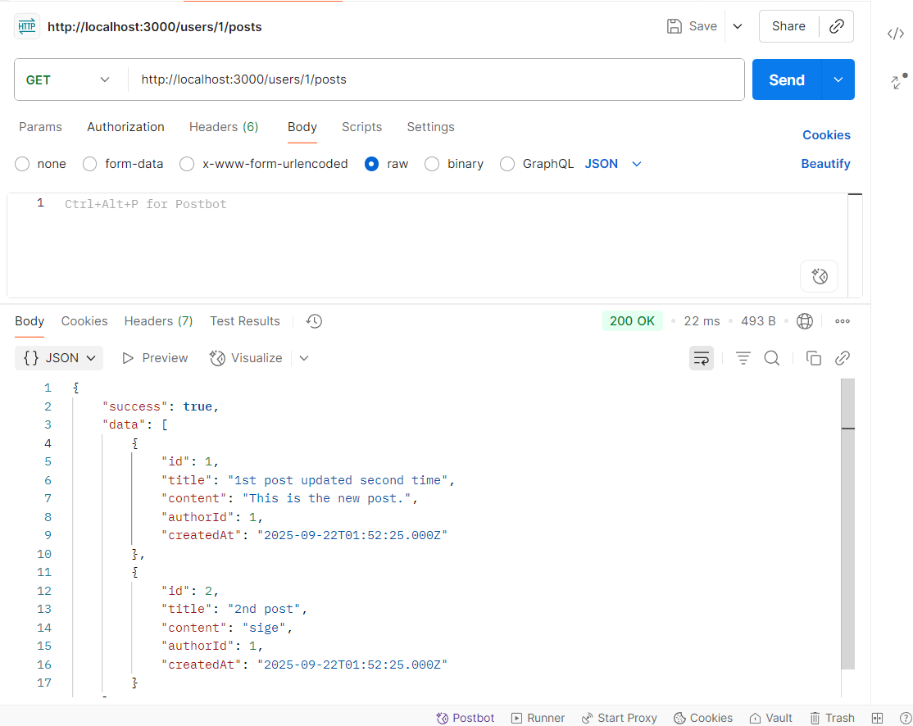
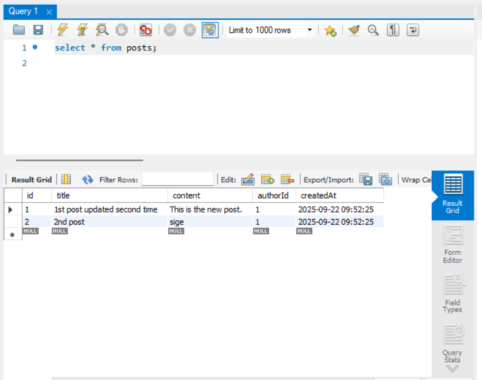
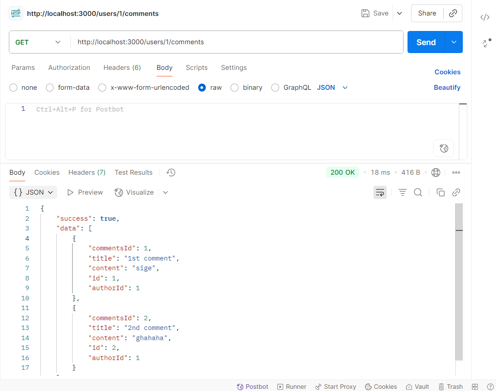
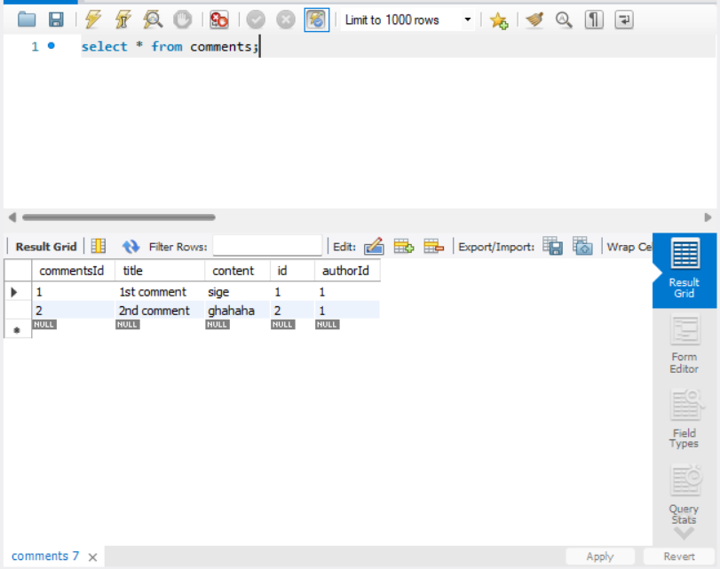
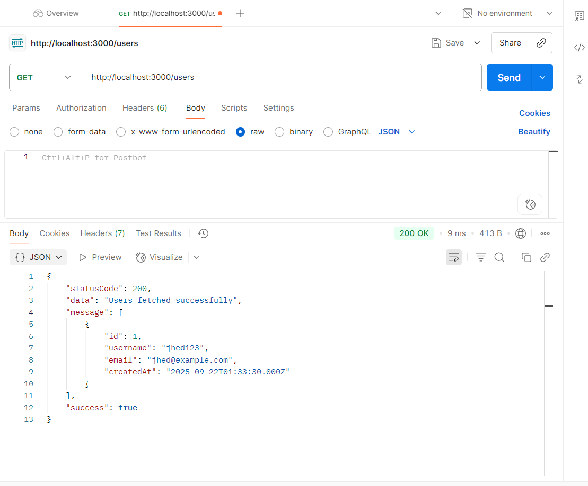
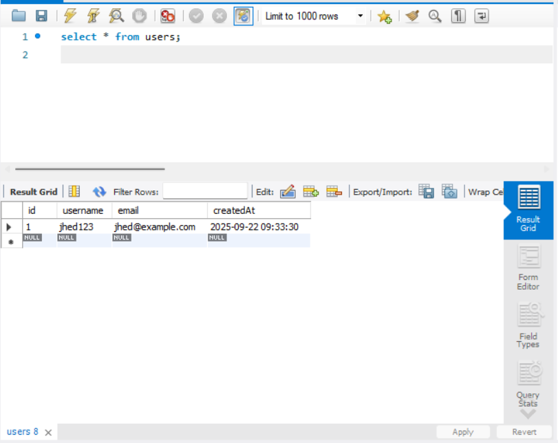
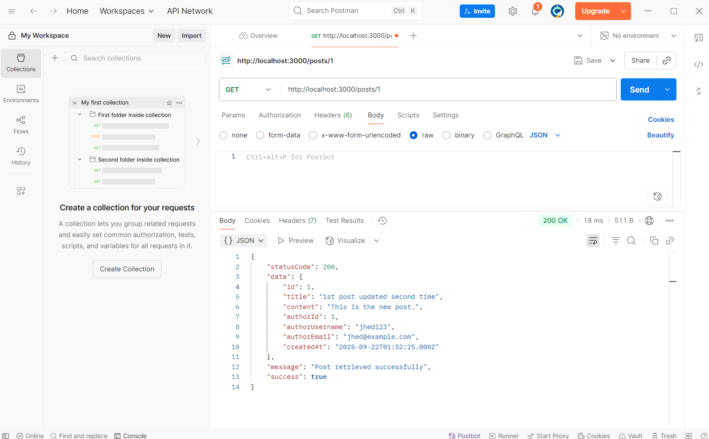

# Midterms

## Challenge 1

### Task
Get all posts by a specific author.

### Images
  

---

## Challenge 2

### Task
Associate comments with users (each comment belongs to the user who wrote it).

### Images
  

---

## Challenge 3 (Bonus)

### Task
Populate author data in post responses (return `username` and `email` along with post data).

### Images
  
  

